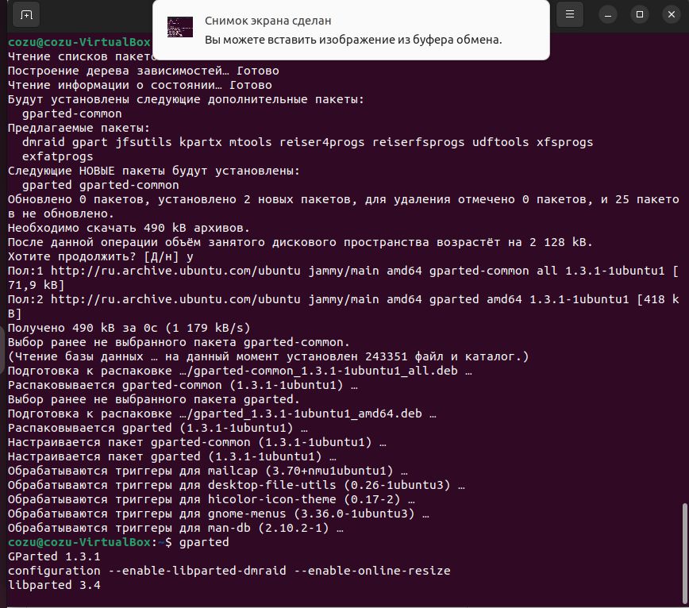
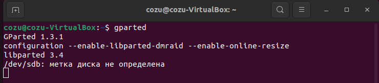
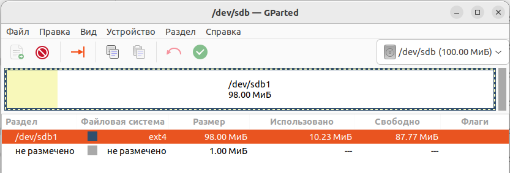
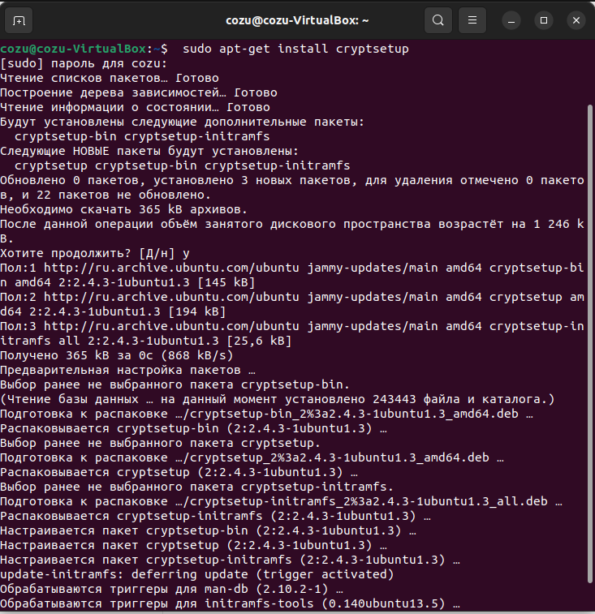
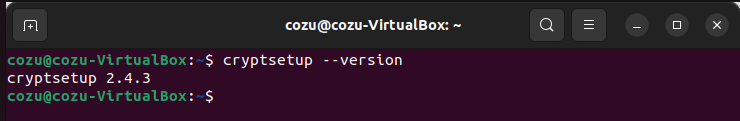
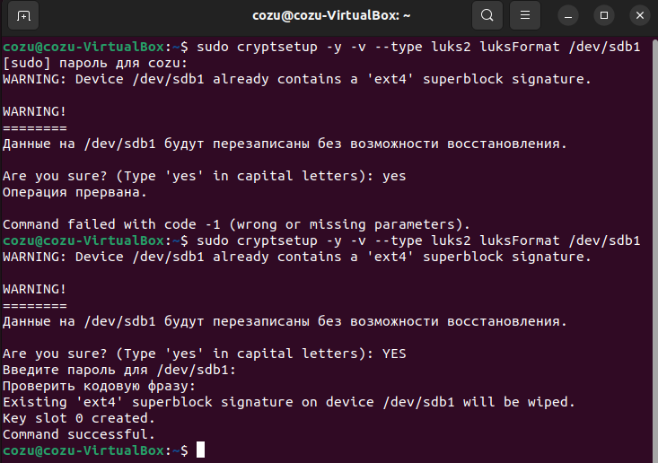
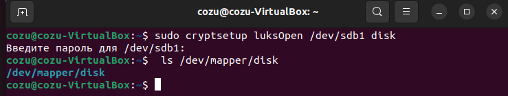
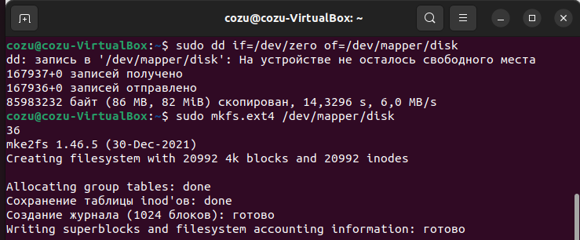
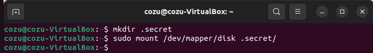
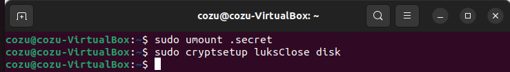

# Домашнее задание к занятию  «Защита хоста»

### Задание 1

1. Установите **eCryptfs**.
2. Добавьте пользователя cryptouser.
3. Зашифруйте домашний каталог пользователя с помощью eCryptfs.


*В качестве ответа  пришлите снимки экрана домашнего каталога пользователя с исходными и зашифрованными данными.*  

### Ответ


### Задание 2

1. Установите поддержку **LUKS**.
2. Создайте небольшой раздел, например, 100 Мб.
3. Зашифруйте созданный раздел с помощью LUKS.

*В качестве ответа пришлите снимки экрана с поэтапным выполнением задания.*

### Ответ

#### Подготовка диска:
```
user@user:~$ sudo apt install gparted
```


#### Установка LUKS (должна быть установлено по умолчанию):
```
user@user:~$ sudo apt-get install cryptsetup
```

#### Проверка установки:
```
user@user:~$ cryptsetup --version
```

#### Подготовка раздела (luksFormat):
```
user@user:~$ sudo cryptsetup -y -v --type luks2 luksFormat /dev/sdb1
```

#### Монтирование раздела:
```
user@user:~$ sudo cryptsetup luksOpen /dev/sdb1 disk
user@user:~$ ls /dev/mapper/disk
```

#### Форматирование раздела:
```
user@user:~$ sudo dd if=/dev/zero of=/dev/mapper/disk
user@user:~$ sudo mkfs.ext4 /dev/mapper/disk
```

#### Монтирование «открытого» раздела:
```
user@user:~$ mkdir .secret
user@user:~$ sudo mount /dev/mapper/disk .secret/
```

#### Завершение работы:
```
user@user:~$ sudo umount .secret
user@user:~$ sudo cryptsetup luksClose disk
```



#### Проверка шифрования:
```
sudo cryptsetup luksDump /dev/sdb1
```


